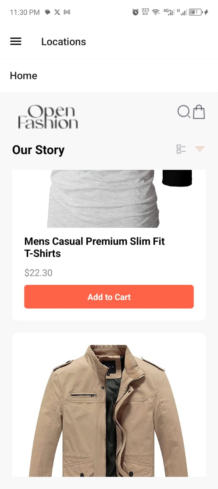
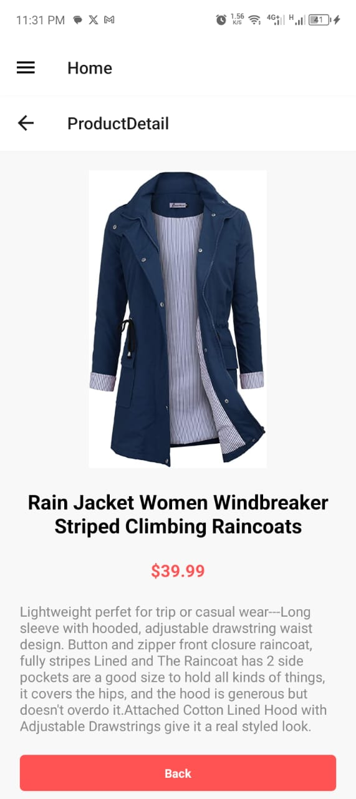
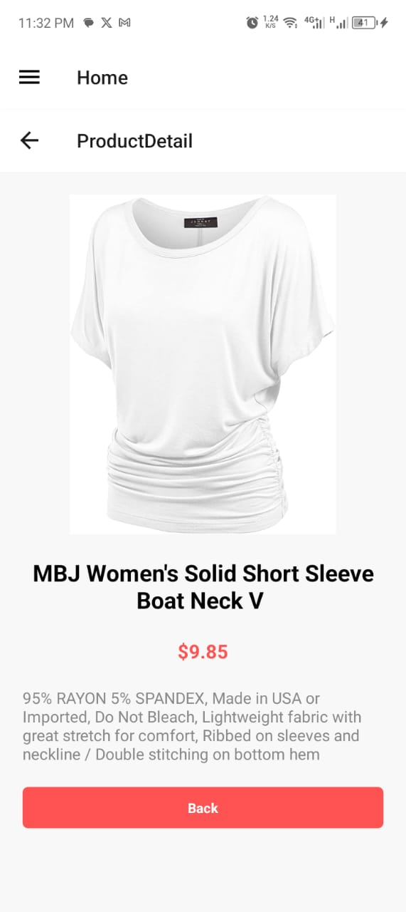
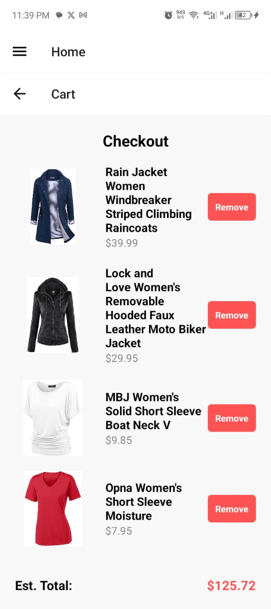
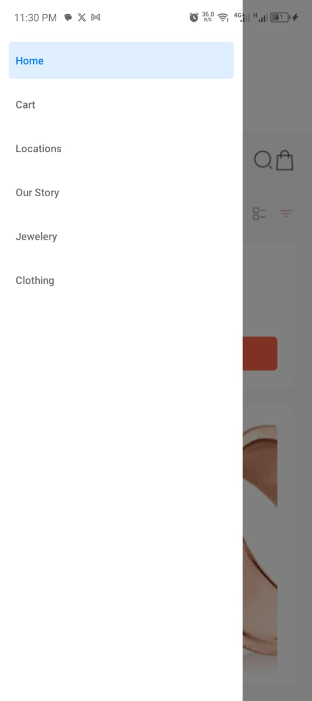

# 11357247

## Mobile Application Development - Assignment 7

This project is built upon the previous assignment design, adding additional components and functionality to make use of an api to get products for the online store.

### Components

1. **HomeScreen**:
   - Displays a list of available products fetched from an external API.
   - Each product includes an "Add to Cart" button.

2. **ProductDetailScreen**:
   - Displays detailed information about a selected product.
   - Includes an "Add to Cart" button.

3. **CartScreen**:
   - Displays selected items that have been added to the cart.
   - Each item includes a "Remove from Cart" button.

4. **Drawer Component/Navigation Menu**:
   - Accessible through a swipe gesture or button.
   - Provides navigation between HomeScreen, ProductDetailScreen, and CartScreen.

### Functionality

- **View a list of available products**: The application fetches product data from an external API using `fetch` or `axios`.
- **Preview product details**: Users can click on a product to view more details.
- **Add products to the cart**: Users can add products to their cart from both the HomeScreen and ProductDetailScreen.
- **Remove products from the cart**: Users can remove items from their cart in the CartScreen.
- **View items in the cart**: Users can view a list of selected items in the CartScreen.

### Data Storage

- **Local Storage**: Selected items are stored locally on the device using `AsyncStorage`.

### Design Choices

- **Navigation**: Implemented using a drawer component for ease of access.
- **State Management**: Used React hooks (`useState`, `useEffect`) for managing state and asynchronous operations.
- **Styling**: Followed the provided UI mockup to ensure a consistent and user-friendly design.
- **Icons**: Utilized icon packages for better visual representation of buttons and actions.

### Screenshots

